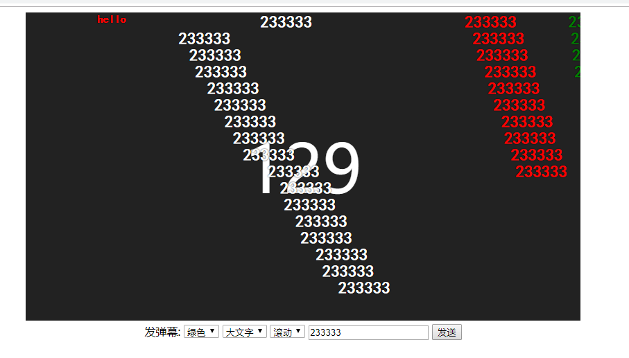

# 弹幕之swoole
#### 这是一个利用swoole实现高性能弹幕的例子

## 使用
###### 1、打开server/server.php文件
将`$server = new Swoole\WebSocket\Server('0.0.0.0', 2333);`中端口`2333`换成指定端口

###### 2、打开client/index.html文件
将`var ws = new WebSocket("ws://192.168.123.100:2333");`中的ip和端口换掉

###### 3、启动server.php服务
```
sudo php server/server.php 
```
或者
```
sudo nohup php server/server.php >> /dev/null 2>&1 &
```

###### 4、访问client下的index.html

